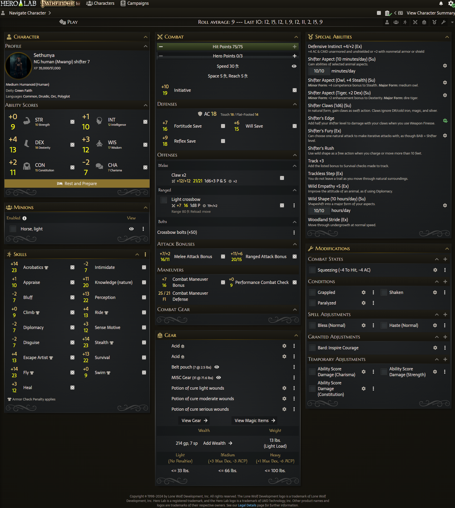
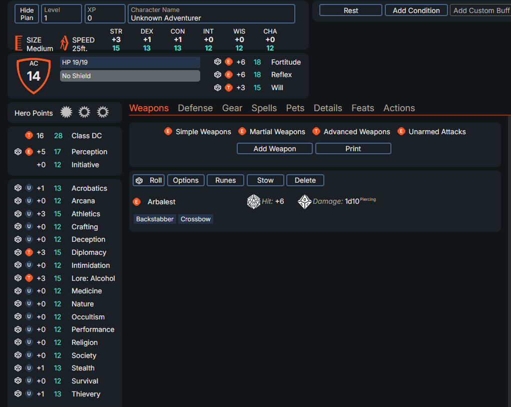
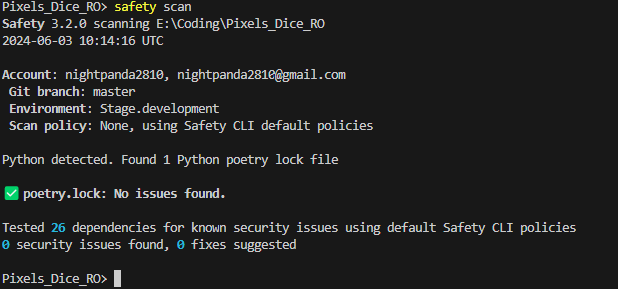
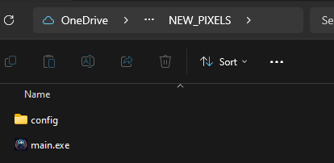
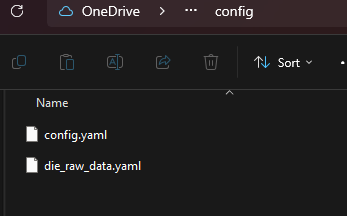
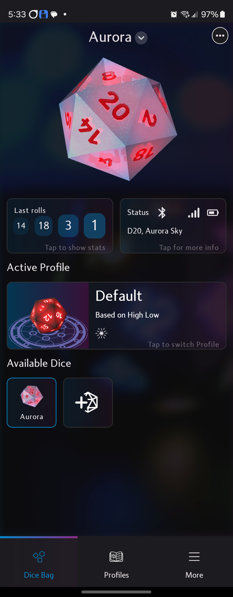
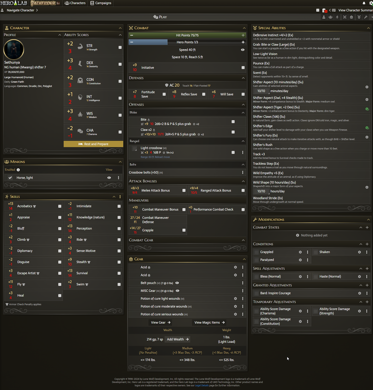

### IN DEVELOPMENT
# HLO Pixels Dice Integration
Simple application with Chrome extension to show modified rolls directly within Herolab Online and Pathbuilder Online with Pixels Dice from https://gamewithpixels.com/

## Known Isues and Limitations
### Issues
* Chrome extension does not function on initial load of page.
    * Simply refresh the page after loading your character.
    * Switching characters works. 
    * This only appears to happen on newly opened tabs.
    * Also appears to be only with Herolab.
* App seems to hang if launched and sit running without a die roll.
    * Have been unable to consistently reproduce. 
    * Suspect rolling the die a single time stops this behaviour, but is untested. As far as I can tell, the die is not going to sleep. 
    * I have played in 2 sessions so far with this current version of the app, and this has only happened before we started rolling. I never had to restart the app during 4-6 hour long sessions.
* Herolab
    * The right sidebar, the AC is being duplicated, and various other modifers are not. 
        * I do not believe this is worth fixing, as it will require a significant re-write of the Chrome extension. Most items are done dynamically, and fixing this requires targeting most items specifically, making the code more complex.
* Pathbuilder
    * Not all modifiers are supported.

### Limitations
* Your die must NOT be connected to your phone. On Android, simply closing the Pixels app works. I assume the same for IOS.
    * This will always be true.
* Only a single D20 is supported.
* Only the online MongoDB Atlas database is supported for roll history and averages.

### To-Do
* Make it work without VLC Media Player installed if enable_audio is set to false, or use a different audio library.

# Testing
## Requirements
* Single Pixels D20.
* A character in Hero Lab Online or Pathbuilder 2e Online. 
    * Pathfinder 1e, 2e, and Starfinder have been tested with HeroLab. Most extensivly with PF1.
* Browser that supports Chrome extensions with the extension installed. See link in readme to download.
* Windows, Linux, or Mac OS.
    * I officially support Windows 10 and 11. Would like to know if it works on 7 if anyone uses it, however I will not support it.
        * Untested on Windows 10.
        * Untested on Mac OS.
        * Tested working on Linux Mint Debian Edition, however this was prior to adding the tray icon for Windows.

## What I'd like tested, outside general usage
- App hanging if open and unused. 
    - I have no idea what is causing this. It may be normal and expected, but I don't have enough data to know for sure.
- HeroLab
    - D20 game 
- Mac OS
    - If it works, do you have a tray icon?
- Linux
    - If it works, do you have a tray icon?

## Usage
### Simple
This is the simplest way to use this app, requiring minimal setup. More advanced (and as a result a bit more secure) section below. 
- Your system may flag this as a virus, as it is my understanding packaging an EXE with Python is weird. When I ran it through virustotal it gave me a heart attack until I did some research! I simply run Defender and it was fine.
- Here is a screenshot of the safety library scan on this project.
    - 
- You MUST have the Pixels app on your phone completely shut down, otherwise the die will not connect to your computer. It helps if you have connect/disconnect flashes configured for your die.
1. Install Chrome extension into your browser.
2. Install VLC Media Player (currently required to run, even without sound effects enabled).
3. Place main.exe in a folder.
    - You can rename this file if you'd like.
4. Within this folder, a folder named "config" containing config.yaml and die_raw_data.yaml.
    - You can copy the config folder from this repository, rename example_config.yaml to config.yaml.
        -  >
5. Populate config.yaml with your required settings.
    1. From the Pixels app, get your die name. 
        - In this screenshot, "Aurora" is the die name.
        - 
    2. DO NOT configure more than a single D20. 
        - I have no idea what will happen if you do this, as I only have a single D20 so far.
6. Load a character in Hero Lab Online or Pathbuilder 2e Online.
    - If you do not see duplicated modifiers, refresh the page. You should see these even if main.exe is not running.
    - Without a die rolled, the additional data on screen will be yellow in color.
        - 
7. Run main.exe
    - A tray icon will appear in Windows.
8. To quit, right-click on the tray icon and click quit.

### Additional information
- The Chrome extension is configurable. DO NOT modify Host/Port. I haven't found a way to make this work yet without a certificate. Feature may be removed.

### Advanced
These steps are for Windows, but should be similar in Linux. Mac OS you are on your own. You may need a basic understanding on how to setup a Python application.
1. Install Python 3.11.x (3.12 will not work)
2. Install poetry package: pip install poetry
3. Download this repository as a zip file and extract it to your desired location.
4. Open a command/terminal window and navigate to the folder where main.py is located.
    - If you are using Windows, you can quickly get to this location by clearing out the path within an open folder window, typing CMD, and pressing enter.
5. Run: poetry shell
6. Run: poetry install
7. Follow the Simple steps above, 1-6, but skip step 3.
8. Run: poetry run ./main.py or python ./main.py
    - Linux/Mac users may have trouble here due to the tray icon I recently added, as that has only been tested in Windows.
9. To quit, right-click on the tray icon and click quit.