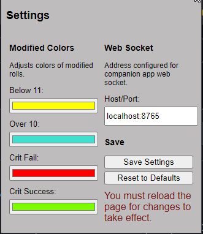

### IN DEVELOPMENT
# HLO Pixels Dice Integration
Simple application with Chrome extension to show modified rolls directly within Herolab Online and Pathbuilder Online with Pixels Dice from https://gamewithpixels.com/

## Known Isues and Limitations
### Issues
* Chrome extension does not function on initial load of page.
    * Simply refresh the page after loading your character.
    * Switching characters works. 
    * This only appears to happen on newly opened tabs.
    * Also appears to be only with Herolab.
* App seems to hang if launched and sit running without a die roll.
    * Have been unable to consistently reproduce. 
    * Suspect rolling the die a single time stops this behaviour, but is untested. As far as I can tell, the die is not going to sleep. 
    * I have played in 2 sessions so far with this current version of the app, and this has only happened before we started rolling. I never had to restart the app during 4-6 hour long sessions.
* Herolab
    * The right sidebar has inconsistent results. Some items work, and some duplicate that are undesirable. 
        * I do not believe this is worth fixing, as it will require a significant re-write of the Chrome extension. Most items are done dynamically, and fixing this requires targeting most items specifically, making the code more complex. Also does anyone actually use this? It's all duplicate information to me. 
* Pathbuilder
    * Not all modifiers are supported.
* Required software
    * VLC Media Player must be installed or the companion app will not function.

### Limitations
* Your die must NOT be connected to your phone. On Android, simply closing the Pixels app works. I assume the same for IOS.
    * This will always be true.
* Only a single D20 is supported.
* If you are using Brave browser, you must disable shields for HeroLab and PathBuilder in order for the extension to communicate with the companion application.
* Only the online MongoDB Atlas database is supported for roll history and averages.

### To-Do
* Make it work without VLC Media Player installed if enable_audio is set to false, or use a different audio library.
* Local database for averages.

# Testing
## Requirements
* Single Pixels D20.
* A character in Hero Lab Online or Pathbuilder 2e Online. 
    * Pathfinder 1e, 2e, and Starfinder have been tested with HeroLab. Most extensivly with PF1.
* Browser that supports Chrome extensions with the extension installed. See link in readme to download.
* Windows, Linux, or Mac OS.
    * I officially support Windows 10 and 11. Would like to know if it works on 7 if anyone uses it, however I will not support it.
        * Untested on Windows 10.
        * Untested on Mac OS.
        * Tested working on Linux Mint Debian Edition, however this was prior to adding the tray icon for Windows.

## What I'd like tested, outside general usage
- App hanging if open and unused. 
    - I have no idea what is causing this. It may be normal and expected, but I don't have enough data to know for sure. It seems to be mitigated by rolling the die for the first time, then runs all night. 
- HeroLab
    - D20 game 
- Mac OS
    - If it works, do you have a tray icon?
- Linux
    - If it works, do you have a tray icon?

## Usage
### Simple
This is the simplest way to use this app, requiring minimal setup. More advanced (and as a result a bit more secure) section below. 
- Your system may flag this as a virus, as it is my understanding packaging an EXE with Python is weird. When I ran it through virustotal it gave me a heart attack until I did some research! I simply run Defender and it was fine.
- Here is a screenshot of the safety library scan on this project.
    - 
- You MUST have the Pixels app on your phone completely shut down, otherwise the die will not connect to your computer. It helps if you have connect/disconnect flashes configured for your die.
1. Install Chrome extension into your browser.
2. Install VLC Media Player (currently required to run, even without sound effects enabled).
3. Download one or both .exe and the Config folder. Place one or both main.exe in your desired location. Console version available to help with troubleshooting.
    - You can rename this file if you'd like.
4. Within this folder, create config.yaml, or rename example_config.yaml.
    - die_raw_data.yaml IS REQUIRED, but DO NOT modify this. I did it this way to make any updates easier should they be necessary.
    -  >
5. Populate config.yaml with your required settings.
    1. From the Pixels app, get your die name. 
        - Note: If there are multiple dice with the same name, there will probably be some sort of issue. Likely simply connecting to the incorrect die. 
        - In this screenshot, "Aurora" is the die name.
        - 
    2. DO NOT configure more than a single D20. 
        - I have no idea what will happen if you do this, as I only have a single D20 so far.
6. Load a character in Hero Lab Online or Pathbuilder 2e Online.
    - If you do not see duplicated modifiers, refresh the page. You should see these even if main.exe is not running.
    - When a die has not yet been rolled, the additional data on screen will be yellow in color, as well as being the same number as the modifier. By default, actual rolled numbers 2-10 will be yellow, 11-19 will be blue, 1's will be red, and 20s will be green. This can be changed within the extensions settings.
        - See main screenshots at top of the page.
7. Run main.exe
    - A tray icon will appear in Windows.
8. To quit, right-click on the tray icon and click quit.

### Roll averages
- You must create a MongoDB Atlas account and create a database. I don't have instructions for this at this time.

### Additional information
- The Chrome extension is configurable. DO NOT modify Host/Port. I haven't found a way to make this work yet without a certificate. Feature likely to be removed.
- Firmware versions newer than 3-25-2024 may not work, if anything breaks fixes will come after I receive my additional dice.
- If you are going through the trouble of setting up the Mongo database for roll averages, please be aware the averages displayed within HLO take longer to update than the rest of the modifiers. 

### Advanced
These steps are for Windows, but should be similar in Linux. Mac OS you are on your own. You will need a basic understanding on how to setup a Python application.
1. Install Python 3.11.x (3.12 will not work)
2. Install poetry package: pip install poetry
3. Download this repository as a zip file and extract it to your desired location.
4. Open a command/terminal window and navigate to the folder where main.py is located.
    - If you are using Windows, you can quickly get to this location by clearing out the path within an open folder window, typing CMD, and pressing enter.
5. Run: poetry shell
6. Run: poetry install
7. Follow the Simple steps above, 1-6, but skip step 3.
8. Run: poetry run ./main.py or python ./main.py
    - Linux/Mac users may have trouble here due to the tray icon I recently added, as that has only been tested in Windows.
9. To quit, right-click on the tray icon and click quit.